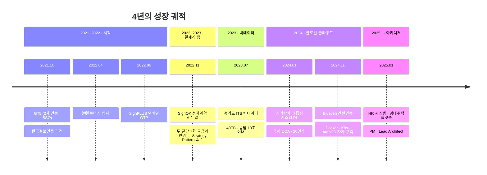

---

## 🎯 About

> **"왜 이 구조여야 하는가"** 를 먼저 묻는 백엔드 개발자.

> [!NOTE]
> 보안 · 인증 · 교통 · 공공 SI 도메인에서 **약 4년간 7개 이상의 프로젝트**를 수행했습니다.
> 팀원으로 시작해 **PL → PM · Lead Architect** 로 성장하며, 설계 · 개발 · 운영 · 리딩의 균형을 추구합니다.

 

## 🗓️ Career Timeline

 

## 💎 Core Competencies

<table>
<tr>
<td width="50%">

### 🔧 백엔드 설계 · API 개발
Spring Boot 기반 RESTful API 설계·개발. **ERD/DB 설계부터 API 명세까지** 전 과정 주도.

</td>
<td width="50%">

### ⚡ 대용량 데이터 처리 · 성능 최적화
**40TB 교통 빅데이터** 가공. 집계 테이블·쿼리 튜닝·파티셔닝으로 **응답 10초 이내**.

</td>
</tr>
<tr>
<td>

### 🔐 결제 · 인증 시스템 연동
다우페이 PG, KG모빌리언스 본인인증, JWT 기반 인증 — **다수의 외부 연동** 구현.

</td>
<td>

### 🚀 CI/CD · 인프라 자동화
GitLab CI/CD · **Docker · Kubernetes · ArgoCD** 기반 자동 배포 환경 직접 구축.

</td>
</tr>
<tr>
<td>

### 📊 Spring Batch 배치 설계
여러 프로젝트에서 **배치 프로그램 전담**. 정기 결제·쿠폰 만료·통계 적재 자동화.

</td>
<td>

### 🗺️ GIS 데이터 시각화
**Mapbox 기반** 교통 데이터 시각화. 통계 대시보드 설계 · 의사결정 데이터 표출.

</td>
</tr>
<tr>
<td>

### 👥 프로젝트 리더십 (PL)
스리랑카 · Blueveri · HR · 임대주택 — **4개 프로젝트 PL/PM 수행**. 일정·이해관계자 커뮤니케이션 담당.

</td>
<td>

### 🛠️ Agile 협업
주 단위 스프린트 · 회고 도입 제안. **Jira · Confluence · Notion · Slack** 일상 활용.

</td>
</tr>
</table>

 

## 📈 Numbers That Matter

| 💼 경력 | 🗂️ 프로젝트 | 💾 빅데이터 | ⚡ 응답속도 | 👥 PL 팀 규모 | 🗺️ 통합 지자체 |
|:---:|:---:|:---:|:---:|:---:|:---:|
| **3년 11개월** | **7+** | **40TB** | **10초 이내** | **20인** | **31개** |
| ㈜블루더스 · 재직중 | SI · 보안 · 교통 · 인증 | 경기도 ITS | 수십초 → 10초 | 국제 ODA | KT · 교통정보센터 |

 

## 🛠️ Tech Stack

<b>🔵 Back-End</b>

 

<b>🗄️ Database</b>

 

<b>☸️ Infrastructure / DevOps</b>

 

<b>🎨 Front-End / View</b>

 

<b>🤝 Collaboration</b>

 

 

## 🚀 Featured Projects

<b>🏢 2025.01 ~ &nbsp;|&nbsp; HR 시스템 · 민간임대주택 플랫폼 &nbsp;PM · Lead Architect</b>

 

> 인사·급여·조직·근태 통합 HR Admin 시스템 + 대규모 정산·계약 데이터 관리 임대주택 플랫폼

- Java · Spring Boot **멀티 프로젝트 Gradle 구조** 도입 — 모듈 간 의존성 분리
- **PostgreSQL 아키텍처** 수립 및 백엔드 핵심 구조 설계
- Spring Security · JWT 기반 **부서별 권한 분기** · HttpOnly 쿠키 보안 체계
- WBS 기반 일정 조율 · 고객사 대외 커뮤니케이션 리딩

`Spring Boot` `PostgreSQL` `JPA` `QueryDSL` `Spring Batch` `JWT` `GitLab CI/CD`

<b>☸️ 2024.11 ~ 2024.12 &nbsp;|&nbsp; Blueveri 간편인증 통합 시스템 &nbsp;PL · Cloud Native</b>

 

> **미경험 기술이던 Docker · Kubernetes를 자가 학습으로 구축**, 컨테이너 빌드 · 자동 배포 환경을 직접 완성한 프로젝트.

- Docker · Kubernetes 기반 클라우드 네이티브 인프라 구성 (자가 학습)
- **GitLab CI/CD** 파이프라인을 통한 컨테이너 빌드
- **ArgoCD** 기반 GitOps 자동 배포
- 다우페이 PG 결제 API 연동

`Docker` `Kubernetes` `GitLab CI/CD` `ArgoCD`

<b>🌏 2024.01 ~ 2024.08 &nbsp;|&nbsp; 스리랑카 교통량 시스템 구축 (국제 ODA) &nbsp;PL · 20인 팀</b>

 

> **수기 수집 과정을 디지털 자동화 시스템으로 전환**, 현지 RDA(도로개발청)로부터 공식 긍정 평가 확보.

- 시스템 ERD/DB 설계 및 어드민 애플리케이션 개발
- 통계 · 조사 프로세스 구현
- **Mapbox 기반 GIS** 통계 데이터 시각화
- 국내외 20인 팀 + 현지 정부기관 협업 리딩

`Spring Boot` `PostgreSQL` `JPA` `Thymeleaf` `Mapbox`

<b>📊 2023.07 ~ 2023.12 &nbsp;|&nbsp; 경기도 ITS 연계 빅데이터 사업 (40TB) &nbsp;26인 팀</b>

 

> 약 **40TB 빅데이터의 통계 표출 응답을 수십 초 → 10초 이내**로 개선, 완료보고회에서 국장·지자체 담당자 긍정 평가.

- **31개 지자체** 교통 빅데이터 운영 시스템 구축
- **쿼리 튜닝 · 집계성 테이블 · 연·월 파티셔닝 · 인덱스 최적화**
- KG모빌리언스 본인인증 API 연동
- Mapbox GIS 기반 교통 데이터 시각화 · 통계 메뉴 전담

`eGovFramework` `PostgreSQL` `MyBatis` `JSP` `Mapbox`

<b>🚌 2022.02 ~ 2024.05 &nbsp;|&nbsp; 모잠비크 교통 실태 조사 (KOICA ODA) &nbsp;50인 팀</b>

 

> 대중교통 모니터링 · 빅데이터 분석 부문에서 완료보고회 국장 긍정 평가.

- Admin / Operator / Portal / Police App 백엔드 개발
- ERD 설계 · GitLab CI/CD 구축 · 자동 배포
- KG모빌리언스 본인인증 API 연동

`Spring` `GitLab CI/CD` `PostgreSQL` `Mapbox`

<b>💳 2022.11 ~ 2023.07 &nbsp;|&nbsp; SignOK 전자계약 리뉴얼 (한국정보인증 파견)</b>

 

> **두 달간 7번 바뀐 요금제 정책**을, 결제·요금제 로직을 **Strategy Pattern**으로 모듈화해 코드 변경 없이 흡수. 약속된 납기 준수.

- V1 API 리뉴얼 · Strategy Pattern 결제 모듈
- Spring Batch 기반 정기 결제·쿠폰 만료 처리
- 다우페이 PG 결제 API 연동

`Spring Boot` `Strategy Pattern` `Spring Batch`

<b>🔑 2022.06 ~ 2022.12 &nbsp;|&nbsp; SignPLUS 모바일 OTP · 관리 시스템 (한국정보인증 파견)</b>

 

- JWT 토큰 인증 방식 REST API 연동
- 요금제 · 결제 프로세스 · 다우페이 PG 연동
- 배포 완료 후 운영 중

`Spring Boot` `JWT` `REST API`

 

## 🧪 Side Learning

> 본업과 별개로 **AI Agent · RAG 파이프라인** 학습 중. *(모두 설계/계획 단계)*

| Repo | Stack | Topic |
|---|---|---|
| [`ai-compliance-guard`](https://github.com/achul1026/ai-compliance-guard) | Java · Spring Boot · **LangChain4j** · **LangGraph** · PostgreSQL+pgvector · GPT-4o · Solar | Stateful Multi-Agent + Hybrid RAG 기반 컴플라이언스 감사 |
| [`ai-quant-broker`](https://github.com/achul1026/ai-quant-broker) | Python · LangGraph · TimescaleDB · Chroma/Qdrant · Streamlit | 기술지표 + 시장 감성분석 하이브리드 퀀트 트레이딩 |
| [`AI-Agent-Engineering`](https://github.com/achul1026/AI-Agent-Engineering) | Python · PLpgSQL | AI 에이전트 엔지니어링 학습 |

 

## 💬 Philosophy

> [!TIP]
> ### *"코드 한 줄보다, 그 코드가 놓이는 구조를 먼저 고민합니다."*
>
> 입사 초반에는 주어진 기능을 빠르게 구현하는 것이 목표였습니다.
> 여러 프로젝트를 거치며 **"왜 이 구조여야 하는가"** 를 스스로 묻기 시작했고,
> 비즈니스 요구를 기술 구조로 번역하는 일에 점점 더 깊이 관여하게 되었습니다.
>
> — *기능 구현자에서, 시스템 설계자로*

> [!IMPORTANT]
> ### *모르는 건 빠르게 배우고, 아는 건 구조적으로 개선한다.*
>
> 두 달간 7번 바뀐 요금제 정책을 **Strategy Pattern**으로 흡수했고,
> 미경험 기술이던 **Docker · Kubernetes를 자가 학습**해 자동 배포 환경을 직접 구축했습니다.
> 낯선 기술 앞에서 두려움보다 설렘을 느끼는 — 그것이 제 성장의 동력입니다.

 

