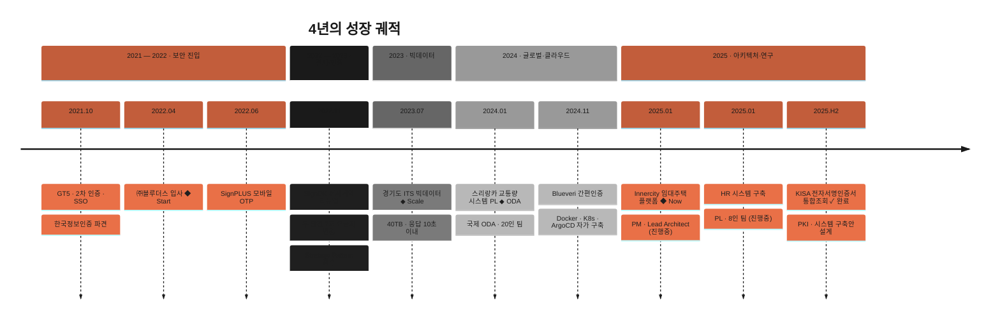

`● 현재 재직중 · 진행 프로젝트 2건` &nbsp;·&nbsp; `CHUL · /profile · v2026.05` &nbsp;·&nbsp; `Seoul · KST`

---

`— Back-end Developer · Team Lead · System Architect —`

 

 

 

|  |  |
|---|---|
| **Role** | Back-end · PL/PM · Lead Architect |
| **Company** | ㈜블루더스 · 재직중 *(3y 11m)* |
| **Email** | [xcaywin@kakao.com](mailto:xcaywin@kakao.com) |
| **GitHub** | [@achul1026](https://github.com/achul1026) |

---

## § 01 &nbsp; Numbers that matter
`as of 2026.05`

| Experience | Projects | Big data | Response | PL team | Domains |
|:---:|:---:|:---:|:---:|:---:|:---:|
| **3**y **11**m | **09**+ | **40**TB | **≤10**s | **20**p | **06**+ |
| `㈜블루더스 재직중` | `SI · 보안 · 인증 · 교통 · 임대` | `경기도 ITS` | `수십초 → 10초 이내` | `국제 ODA · 스리랑카` | `KISA · KOICA · KT · 정부` |

---

## § 02 &nbsp; Career timeline
`2021 — present`

---

## § 03 &nbsp; Core competencies
`8 disciplines`

<table>
<tr>
<td width="50%" valign="top">

###### 01 · API
**백엔드 설계 · API 개발**

Spring Boot 기반 RESTful API 설계 · 개발. **ERD/DB 설계부터 API 명세까지** 전 과정 주도.

</td>
<td width="50%" valign="top">

###### 02 · Scale
**대용량 데이터 · 성능 최적화**

**40TB 교통 빅데이터** 가공. 집계 테이블 · 쿼리 튜닝 · 파티셔닝으로 **응답 10초 이내**.

</td>
</tr>
<tr>
<td valign="top">

###### 03 · Auth
**결제 · 인증 시스템 연동**

다우페이 PG, KG모빌리언스 본인인증, JWT 기반 인증 — **다수의 외부 연동** 구현.

</td>
<td valign="top">

###### 04 · DevOps
**CI/CD · 인프라 자동화**

GitLab CI/CD · **Docker · Kubernetes · ArgoCD** 기반 자동 배포 환경 직접 구축.

</td>
</tr>
<tr>
<td valign="top">

###### 05 · Batch
**Spring Batch 배치 설계**

여러 프로젝트에서 **배치 프로그램 전담**. 정기 결제 · 쿠폰 만료 · 통계 적재 자동화.

</td>
<td valign="top">

###### 06 · GIS
**GIS 데이터 시각화**

**Mapbox 기반** 교통 데이터 시각화. 통계 대시보드 설계 · 의사결정 데이터 표출.

</td>
</tr>
<tr>
<td valign="top">

###### 07 · Lead
**프로젝트 리더십 (PL)**

스리랑카 · Blueveri · HR · 임대주택 — **4개 프로젝트 PL/PM** 수행. 일정 · 이해관계자 커뮤니케이션 담당.

</td>
<td valign="top">

###### 08 · Agile
**Agile 협업**

주 단위 스프린트 · 회고 도입 제안. **Jira · Confluence · Notion · Slack** 일상 활용.

</td>
</tr>
</table>

---

## § 04 &nbsp; Featured projects
`9 selected works`

<code>2025.01 — now</code> &nbsp; <b>Innercity — 민간임대주택 플랫폼</b> &nbsp; <code>PM · LEAD ARCHITECT</code>

 

> 임대주택 운영사 홈페이지 리뉴얼 + 민간임대주택 관리 시스템.
> 대규모 정산 · 계약 데이터를 안정적으로 관리하는 **백엔드 핵심 구조** 수립.

— Java · Spring Boot **멀티 프로젝트 Gradle 구조** · Admin / Tenant Portal / Homepage 모듈 분리
— **PostgreSQL 아키텍처** 수립 및 백엔드 핵심 구조 설계
— Spring Security · JWT 기반 권한 체계 · **HttpOnly 쿠키** 보안
— WBS 기반 일정 조율 · 고객사 대외 커뮤니케이션 리딩

`Spring Boot`&nbsp;·&nbsp;`PostgreSQL`&nbsp;·&nbsp;`JPA`&nbsp;·&nbsp;`QueryDSL`&nbsp;·&nbsp;`Spring Batch`&nbsp;·&nbsp;`JWT`

<code>2025.01 — now</code> &nbsp; <b>HR 시스템 구축</b> &nbsp; <code>PL · 8인 · 70%</code>

 

> 인사 · 급여 · 조직 · 근태 통합 HR Admin 시스템. **전체 백엔드 아키텍처** 담당.

— ERD/DB 설계 전담 · 프로세스 구상
— Spring Security · JWT 기반 **부서별 권한 분기** 보안 아키텍처
— Spring Batch 배치 프로그램 설계·운영
— 프로젝트 셋팅 · GitLab CI/CD 구성

`Spring Boot`&nbsp;·&nbsp;`PostgreSQL`&nbsp;·&nbsp;`JPA`&nbsp;·&nbsp;`QueryDSL`&nbsp;·&nbsp;`Spring Batch`&nbsp;·&nbsp;`GitLab CI/CD`

<code>2025.H2</code> &nbsp; <b>KISA 전자서명인증서 통합조회 시스템 설계 연구</b> &nbsp; <code>40% · ✓ 완료</code>

 

> **한국인터넷진흥원(KISA) 발주**, 에스지랩 · ㈜블루더스 컨소시엄 수행.
> 입찰공고 2025-118호 · 사업비 94,000,000원 · **사업 정상 종료**.

— **PKI 기반 인증서 lifecycle** (발급 · 통합조회 · 안전한 폐기) 시스템 구축안 설계
— **OpenSSL 기반 PKI 암호 체계** · 디지털 서명·검증 표준 분석
— 공공·금융·민간 발주기관 인증서 연동 아키텍처 제시
— Blueveri (KISA 간편인증 표준 준용 솔루션) 구축 경험 기반 기술적 쟁점·제약사항 분석

`PKI`&nbsp;·&nbsp;`OpenSSL`&nbsp;·&nbsp;`전자서명`&nbsp;·&nbsp;`Certificate Lifecycle`&nbsp;·&nbsp;`설계 연구`

<code>2024.11 — 12</code> &nbsp; <b>Blueveri 간편인증 통합 시스템</b> &nbsp; <code>PL · CLOUD NATIVE</code>

 

> **미경험 기술이던 Docker · Kubernetes를 자가 학습**으로 구축, 컨테이너 빌드 · 자동 배포 환경을 직접 완성.

— Docker · Kubernetes 기반 클라우드 네이티브 인프라 구성 (자가 학습)
— **GitLab CI/CD** 파이프라인을 통한 컨테이너 빌드
— **ArgoCD** 기반 GitOps 자동 배포
— 다우페이 PG 결제 API 연동

`Docker`&nbsp;·&nbsp;`Kubernetes`&nbsp;·&nbsp;`GitLab CI/CD`&nbsp;·&nbsp;`ArgoCD`

<code>2024.01 — 08</code> &nbsp; <b>스리랑카 교통량 시스템 (국제 ODA)</b> &nbsp; <code>PL · 20인 팀</code>

 

> **수기 수집 과정을 디지털 자동화 시스템으로 전환**, 현지 RDA(도로개발청)로부터 공식 긍정 평가 확보.

— 시스템 ERD/DB 설계 · 어드민 애플리케이션 개발
— 통계 · 조사 프로세스 구현
— **Mapbox 기반 GIS** 통계 데이터 시각화
— 국내외 20인 팀 + 현지 정부기관 협업 리딩

`Spring Boot`&nbsp;·&nbsp;`PostgreSQL`&nbsp;·&nbsp;`JPA`&nbsp;·&nbsp;`Thymeleaf`&nbsp;·&nbsp;`Mapbox`

<code>2023.07 — 12</code> &nbsp; <b>경기도 ITS 연계 빅데이터 사업 (40TB)</b> &nbsp; <code>26인 팀</code>

 

> 약 **40TB 빅데이터의 통계 표출 응답을 수십 초 → 10초 이내**로 개선, 완료보고회 국장·지자체 담당자 긍정 평가.

— **31개 지자체** 교통 빅데이터 운영 시스템 구축
— **쿼리 튜닝 · 집계성 테이블 · 연·월 파티셔닝 · 인덱스 최적화**
— KG모빌리언스 본인인증 API 연동
— Mapbox GIS 기반 교통 데이터 시각화 · 통계 메뉴 전담

`eGovFramework`&nbsp;·&nbsp;`PostgreSQL`&nbsp;·&nbsp;`MyBatis`&nbsp;·&nbsp;`JSP`&nbsp;·&nbsp;`Mapbox`

<code>2022.02 — 2024.05</code> &nbsp; <b>모잠비크 교통 실태 조사 (KOICA ODA)</b> &nbsp; <code>50인 팀</code>

 

> 대중교통 모니터링 · 빅데이터 분석 부문에서 완료보고회 국장 긍정 평가.

— Admin / Operator / Portal / Police App 백엔드 개발
— ERD 설계 · GitLab CI/CD 구축 · 자동 배포
— KG모빌리언스 본인인증 API 연동

`Spring`&nbsp;·&nbsp;`GitLab CI/CD`&nbsp;·&nbsp;`PostgreSQL`&nbsp;·&nbsp;`Mapbox`

<code>2022.11 — 2023.07</code> &nbsp; <b>SignOK 전자계약 리뉴얼 (한국정보인증 파견)</b> &nbsp; <code>STRATEGY PATTERN</code>

 

> **두 달간 7번 바뀐 요금제 정책**을 결제 · 요금제 로직의 **Strategy Pattern** 모듈화로 흡수. 약속된 납기 준수.

— V1 API 리뉴얼 · Strategy Pattern 결제 모듈
— Spring Batch 기반 정기 결제 · 쿠폰 만료 처리
— 다우페이 PG 결제 API 연동

`Spring Boot`&nbsp;·&nbsp;`Strategy Pattern`&nbsp;·&nbsp;`Spring Batch`

<code>2022.06 — 12</code> &nbsp; <b>SignPLUS 모바일 OTP · 관리 시스템</b> &nbsp; <code>한국정보인증 파견</code>

 

> 모바일 OTP 인증 · 결제 통합 시스템. 배포 완료 후 운영 중.

— JWT 토큰 인증 방식 REST API 연동
— 요금제 · 결제 프로세스 · 다우페이 PG 연동

`Spring Boot`&nbsp;·&nbsp;`JWT`&nbsp;·&nbsp;`REST API`

---

## § 05 &nbsp; Tech stack
`Daily · Working · Familiar`

###### Back-end &nbsp;·&nbsp; `DAILY`
**Java** &nbsp;·&nbsp; **Spring Boot** &nbsp;·&nbsp; **Spring Framework** &nbsp;·&nbsp; **Spring Batch** &nbsp;·&nbsp; Spring Security &nbsp;·&nbsp; JPA &nbsp;·&nbsp; QueryDSL &nbsp;·&nbsp; MyBatis &nbsp;·&nbsp; JWT &nbsp;·&nbsp; NestJS

###### Database &nbsp;·&nbsp; `DAILY`
**PostgreSQL** &nbsp;·&nbsp; **Oracle** &nbsp;·&nbsp; MySQL &nbsp;·&nbsp; MariaDB &nbsp;·&nbsp; MSSQL &nbsp;·&nbsp; HiveSQL

###### Infrastructure · DevOps &nbsp;·&nbsp; `WORKING`
**Docker** &nbsp;·&nbsp; **Kubernetes** &nbsp;·&nbsp; **GitLab CI/CD** &nbsp;·&nbsp; **ArgoCD** &nbsp;·&nbsp; Linux &nbsp;·&nbsp; Tomcat &nbsp;·&nbsp; Gradle &nbsp;·&nbsp; Maven

###### Front-end · View &nbsp;·&nbsp; `FAMILIAR`
JavaScript &nbsp;·&nbsp; jQuery &nbsp;·&nbsp; Thymeleaf &nbsp;·&nbsp; JSP &nbsp;·&nbsp; Handlebars &nbsp;·&nbsp; **Mapbox**

###### Collaboration &nbsp;·&nbsp; `DAILY`
**Git** &nbsp;·&nbsp; **Jira** &nbsp;·&nbsp; **Confluence** &nbsp;·&nbsp; **Notion** &nbsp;·&nbsp; **Slack**

---

## § 06 &nbsp; Side learning
`AI · Agent · RAG · 설계 단계`

<table>
<tr>
<td width="33%" valign="top">

###### REPO · 01
[**ai-compliance-guard**](https://github.com/achul1026/ai-compliance-guard)

Stateful Multi-Agent + Hybrid RAG 기반 컴플라이언스 감사 시스템.

`Java` `Spring Boot` `LangChain4j` `LangGraph` `pgvector` `GPT-4o`

</td>
<td width="33%" valign="top">

###### REPO · 02
[**ai-quant-broker**](https://github.com/achul1026/ai-quant-broker)

기술지표 + 시장 감성분석 하이브리드 퀀트 트레이딩 파이프라인.

`Python` `LangGraph` `TimescaleDB` `Chroma/Qdrant` `Streamlit`

</td>
<td width="33%" valign="top">

###### REPO · 03
[**AI-Agent-Engineering**](https://github.com/achul1026/AI-Agent-Engineering)

AI 에이전트 엔지니어링 학습 노트 · 실험 코드.

`Python` `PLpgSQL`

</td>
</tr>
</table>

---

## § 07 &nbsp; Philosophy
`Two beliefs`

<table>
<tr>
<td width="50%" valign="top">

<h1 style="color:#c25d3b">❝</h1>

> ### *코드 한 줄보다,*
> ### *그 코드가 놓이는 구조를 먼저 고민합니다.*

입사 초반에는 주어진 기능을 빠르게 구현하는 것이 목표였습니다.
여러 프로젝트를 거치며 **"왜 이 구조여야 하는가"** 를 스스로 묻기 시작했고, 비즈니스 요구를 기술 구조로 번역하는 일에 점점 더 깊이 관여하게 되었습니다.

`— 기능 구현자에서, 시스템 설계자로`

</td>
<td width="50%" valign="top">

<h1 style="color:#c25d3b">❝</h1>

> ### *모르는 건 빠르게 배우고,*
> ### *아는 건 구조적으로 개선한다.*

두 달간 7번 바뀐 요금제 정책을 **Strategy Pattern**으로 흡수했고, 미경험 기술이던 **Docker · Kubernetes**를 자가 학습해 자동 배포 환경을 직접 구축했습니다.
낯선 기술 앞에서 두려움보다 설렘을 느끼는 — 그것이 제 성장의 동력입니다.

`— 학습 곡선보다, 적용 속도`

</td>
</tr>
</table>

---

`© 2026 · CHUL` &nbsp;·&nbsp; *Designed as a system, not a page.* &nbsp;·&nbsp; [`@achul1026`](https://github.com/achul1026)

